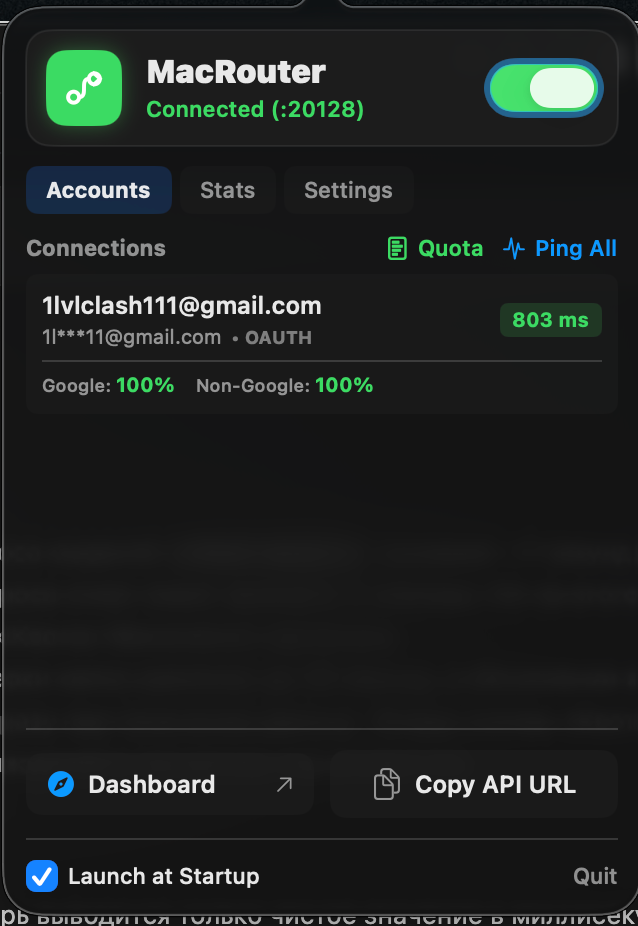

<h1 align="center">
  
  <br>
  MacRouter
</h1>

<p align="center">
  <b>A lightweight, native macOS Menu Bar controller for 9router & Antigravity proxy servers.</b>
</p>

<p align="center">
  <b>English</b> • <a href="README_RU.md">Русский</a>
</p>

<p align="center">
  <a href="https://developer.apple.com/macos/"></a>
  <a href="https://swift.org"></a>
  <a href="https://developer.apple.com/xcode/swiftui/"></a>
  <a href="LICENSE"></a>
  <a href="https://t.me/remn9k"></a>
</p>

<p align="center">
  <a href="#features">Features</a> •
  <a href="#installation">Installation</a> •
  <a href="#project-structure">Structure</a> •
  <a href="#about-this-project">About</a>
</p>

---

<p align="center">
  
</p>

---

## Features

- **Toggle Server Control**: Start and stop your local proxy server directly from the macOS status bar.
- **Live Quota Monitoring**: Real-time percentage breakdowns for model quotas (**Gemini** vs **Claude**) with color-coded status badges.
- **Latency Ping**: One-click latency verification for all connected provider accounts.
- **Privacy Email Masking**: Conceal sensitive email addresses (`1l***11@gmail.com`) for private sharing & live demos.
- **Scrollable Settings**: Configurable port selection, logging toggle, launch at startup, and language switching (EN/RU).
- **Zero Overhead**: Native AppKit + SwiftUI popover implementation with low system resource usage.

---

## Installation

### Option 1: Pre-built Release (Recommended)

1. Download the latest release from the [Releases](../../releases) page.
2. Unzip `MacRouter-macOS.zip` and move `MacRouter.app` to your `/Applications` folder.
3. Open `MacRouter.app`. Click the orange status bar icon near your system clock.

### Option 2: Build from Source

Requirements: macOS 13.0+, Xcode Command Line Tools (`xcode-select --install`).

```bash
# Clone the repository
git clone https://github.com/remn9k/MacRouter.git
cd MacRouter

# Build and package the release app bundle
./scripts/package.sh

# Launch the compiled app
open MacRouter.app
```

---

## Project Structure

```text
macrouter/
├── Package.swift               # SwiftPM Build Manifest
├── AppIcon.icns                # Retina App Icon
├── assets/
│   ├── icon.png                # PNG Logo
│   └── preview.png             # UI Preview Screenshot
├── Sources/
│   └── MacRouter/
│       ├── MacRouterApp.swift         # AppKit & NSPopover entry point
│       ├── PopoverContentView.swift   # SwiftUI User Interface
│       ├── RouterProcessManager.swift # 9router backend process & REST API manager
│       └── AutoStartManager.swift     # Launch at Startup manager (SMAppService)
├── scripts/
│   ├── package.sh              # Release build & packaging script
│   └── generate_icon.swift     # AppIcon.icns generator
├── README.md                   # English Documentation
└── README_RU.md                # Russian Documentation
```

---

## About This Project

This repository was created approximately **90% using AI**, so it's quite likely that something might not work.

If something is not working or if you have any questions:
- Reach out on Telegram: **[@remn9k](https://t.me/remn9k)**

---

## License

Distributed under the MIT License. See `LICENSE` for more information.
